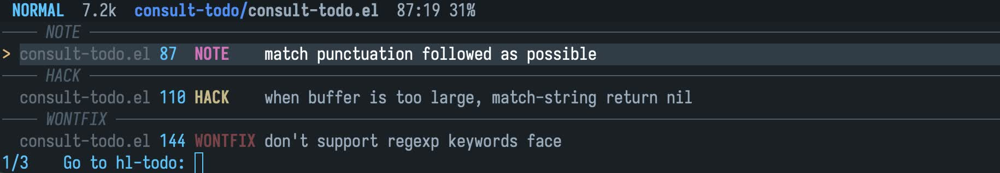
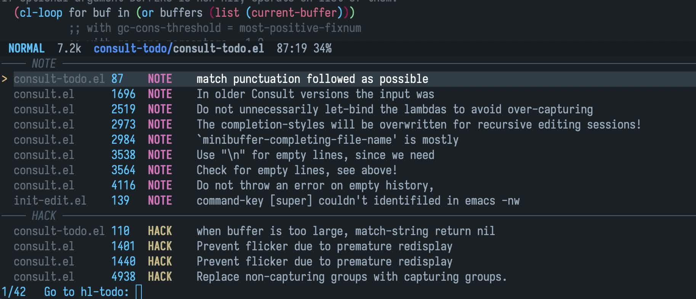

# consult-todo

[](LICENSE)
[](http://melpa.org/#/consult-todo)

Search and jump hl-todo keywords in buffers with consult.

<!-- markdown-toc start -->

## Contents

- [consult-todo](#consult-todo)
  - [Screenshot](#screenshot)
  - [Install](#install)
    - [dependencies](#dependencies)
    - [package](#package)
  - [Usage](#usage)
  - [Customization](#customization)
  - [Todo](#todo)
  - [License](#license)

<!-- markdown-toc end -->

## Screenshot

- `consult-todo`: Jump to hl-todo keywords in current buffer.



- `consult-todo-all`: Jump to hl-todo keywords in all live buffers.



## Install

### dependencies

- Emacs, version >= 27.1
- [hl-todo](https://github.com/tarsius/hl-todo)
- [consult](https://github.com/minad/consult)

### package

- Manually

Clone and add to `load-path`, require the package.

- Melpa

Install with `M-x package-install` `RET` `consult-todo` within Emacs.

## Usage

```elisp
;; Directly
(require 'consult-todo)

;; Or with use-package
(use-package consult-todo :demand t)
```

- `consult-todo`: search in current buffer

- `consult-todo-all`: search in all `hl-todo-mode` enabled buffers

**Warning**: commands below is still buggy, use it as little as possible

- `consult-todo-dir`: search in current directory

- `consult-todo-project`: search in current project

## Customization

- `consult-todo-narrow`: Mapping of narrows and keywords, if it's nil, use default value below instead.

```emacs-lisp
(defconst consult-todo--narrow
  '((?t . "TODO")
    (?f . "FIXME")
    (?b . "BUG")
    (?h . "HACK"))
  "Default mapping of narrow and keywords.")
```

- `consult-todo-other`: Cons for other missing keywords, `(?. . "OTHER")` by default.

- `consult-todo-only-comment`: toggle whether only search keywords in comment, only effective on buffers

## Todo

- [x] search keywords in all project files

## License

See [LICENSE](LICENSE).

[melpa]: http://melpa.org/#/consult-todo
